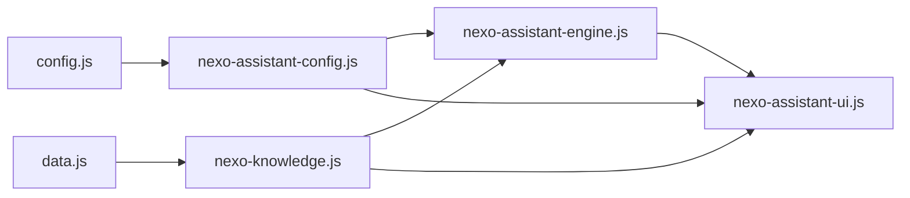

# NEXO Asistente - Fase 3

## Objetivo

Integrar una interfaz publica y honesta para el Asistente digital de NEXO26. La interfaz orienta a visitantes sobre servicios, paquetes, tiempos, requisitos, proyectos publicados y el paquete que podria ajustarse a su negocio.

No usa una API externa de IA, no contiene claves, no hace llamadas de red y no promete resultados garantizados.

## Orden de carga

```html
<link rel="stylesheet" href="assets/css/nexo-assistant.css?v=20260719-phase3">

<script src="assets/js/config.js?v=20260716-final" defer></script>
<script src="assets/js/data.js?v=20260715-new-drafts" defer></script>
<script src="assets/js/nexo-assistant-config.js?v=20260719-phase3" defer></script>
<script src="assets/data/nexo-knowledge.js?v=20260719-phase3" defer></script>
<script src="assets/js/nexo-assistant-engine.js?v=20260719-phase3" defer></script>
<script src="assets/js/nexo-assistant-ui.js?v=20260719-phase3" defer></script>
<script src="assets/js/main.js?v=20260716-final" defer></script>
```

## Dependencias



## Archivos

- `assets/css/nexo-assistant.css`: estilos del launcher, panel, mensajes, pasos y responsive.
- `assets/js/nexo-assistant-ui.js`: interfaz DOM segura conectada al motor.
- `tests/nexo-assistant-ui.test.js`: pruebas funcionales y de seguridad de la UI.
- `docs/NEXO_ASSISTANT_PHASE_3.md`: documentacion de esta fase.
- `index.html`: carga del CSS y scripts del asistente.

Tambien se sincronizaron `assets/js/nexo-assistant-config.js` y `assets/js/nexo-assistant-engine.js` para permitir la accion `generate_visual_direction`, que ya existia como funcion e intencion del motor.

## Experiencia

La interfaz incluye:

- Launcher flotante con etiqueta accesible: `Abrir NEXO Asistente`.
- Panel tipo dialog con titulo `NEXO Asistente`.
- Subtitulo: `Orientacion inicial para tu negocio`.
- Indicador discreto de modo demo.
- Botones de reinicio y cierre.
- Bienvenida con cinco acciones iniciales.
- Entrada libre con limite de 800 caracteres.
- Mensajes de asistente y visitante.
- Acciones rapidas limitadas a cinco por grupo.
- Analisis guiado de ocho pasos.
- Paquetes oficiales.
- Portafolio publico filtrado.
- Recomendacion inicial.
- Estructura sugerida.
- Direccion visual sugerida.
- Resumen para WhatsApp.
- Contacto humano por WhatsApp.
- Accion para borrar conversacion.

## Analisis guiado

El flujo pregunta por temas, no por doce pantallas obligatorias:

1. Giro del negocio.
2. Nombre y zona.
3. Alcance.
4. Canales actuales.
5. Pagina actual.
6. Objetivo.
7. Funciones.
8. Materiales y urgencia.

Cada paso permite continuar, omitir, regresar o cancelar. No todos los campos son obligatorios para obtener orientacion inicial.

## WhatsApp

El resumen se genera con el motor mediante `buildLeadSummary()`.

Reglas:

- Usa `5215517973390`.
- Usa `https://wa.me/`.
- Usa `encodeURIComponent()`.
- Incluye solo datos proporcionados.
- Incluye recomendacion.
- No abre automaticamente.
- Abre solo por accion voluntaria.
- Usa nueva pestana con `noopener noreferrer`.

## Privacidad

La UI muestra el aviso:

> La informacion que escribas se utiliza unicamente para preparar esta orientacion y el resumen que tu decidas enviar por WhatsApp.

No pide contrasenas, datos bancarios, documentos, informacion medica ni datos sensibles. No guarda conversaciones en `localStorage`.

## Accesibilidad

Implementado:

- `role="dialog"`.
- `aria-modal`.
- `aria-labelledby`.
- `aria-describedby`.
- `aria-live` en mensajes.
- Foco inicial.
- Retorno de foco.
- Cierre con Escape.
- Botones semanticos.
- Etiqueta accesible para el input.
- Focus visible.
- `prefers-reduced-motion`.
- Controles tactiles de minimo 44 px.

## Responsive

El panel usa `height: 100dvh` en movil y respeta `safe-area-inset`. El launcher se ubica por encima del boton flotante de WhatsApp para evitar superposicion.

Viewports objetivo de QA:

- 320 x 568
- 360 x 800
- 390 x 844
- 430 x 932
- 768 x 1024
- 1024 x 768
- 1366 x 768
- 1440 x 900
- 1920 x 1080

## Seguridad

En los archivos productivos del asistente no se usa:

- `innerHTML`
- `eval`
- `new Function`
- `document.write`
- `localStorage`
- `fetch`
- `XMLHttpRequest`
- claves o tokens
- `console.log`
- apertura automatica de WhatsApp

La UI usa `textContent`, `createElement`, `appendChild` y atributos seguros.

## Pruebas

Comandos esperados:

```bash
node tests/nexo-assistant-engine.test.js
node tests/nexo-assistant-ui.test.js
node --check assets/js/nexo-assistant-ui.js
node --check assets/js/nexo-assistant-engine.js
node --check assets/data/nexo-knowledge.js
node --check assets/js/nexo-assistant-config.js
node --check assets/js/config.js
node --check assets/js/data.js
node --check assets/js/main.js
git diff --check
```

Resultado minimo:

- 42 pruebas del motor.
- 40 pruebas de interfaz.
- 0 errores de sintaxis.
- 0 errores propios de consola en QA de navegador.
- 0 assets propios con 404.
- 0 overflow horizontal en viewports revisados.

## Limitaciones

- Modo demo local, sin IA generativa externa.
- No guarda historial permanente.
- No envia formularios reales.
- No hace cotizaciones finales.
- No promete disponibilidad inmediata.
- No promete ventas, SEO avanzado ni resultados garantizados.
- No crea maquetas personalizadas gratis.

## Pendiente antes de commit

- Validar visualmente en navegador.
- Revisar responsive en los viewports objetivo.
- Confirmar que la landing publica sigue intacta y sin referencias privadas.
- Revisar `git status`, `git diff --stat` y `git diff --check`.
- Crear el commit local autorizado para esta rama.
